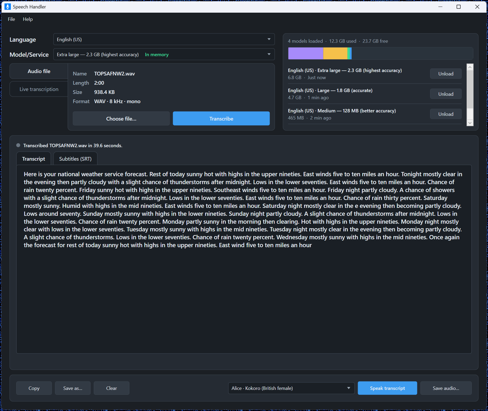

# Speech Handler

Windows desktop app for turning speech into text and text into speech. Transcribe audio files or live input with a local Vosk model, OpenAI Whisper, or ElevenLabs, then play or save the transcript with Kokoro or Piper neural voices.



## Features

- **Transcribe audio files** to plain text and SubRip (`.srt`) subtitles.
- **Live transcription** from a microphone or system-audio (loopback) source, with an input-level meter.
- **Choose a transcription engine**
  - **Vosk** (offline): pick a language and model size, and download models from Transcription settings.
  - **OpenAI Whisper**: `whisper-1`, `gpt-4o-mini-transcribe`, or `gpt-4o-transcribe`, with optional translation to English.
  - **ElevenLabs**: `scribe_v2` or `scribe_v1`.
- **Vosk memory cache**: set how much RAM to reserve for loaded models, keep several in memory so switching is instant, and unload models you no longer need.
- **Spell checking** on the transcript and subtitle editors, with suggestions, Ignore All, and **Add to Dictionary**. Custom words are stored per language.
- **Save and copy** the transcript as `.txt` or subtitles as `.srt`.
- **Speak the transcript** with downloaded **Kokoro** or **Piper** voices, including speaking-speed control.
- **Save spoken audio** of the transcript to a file.

## Requirements

- Windows 10 or 11, 64-bit
- [.NET 10 SDK](https://dotnet.microsoft.com/download) to build from source

Local Vosk models and Kokoro/Piper voice packs download from inside the app. OpenAI and ElevenLabs need an API key (entered in settings, or `OPENAI_API_KEY` / `ELEVENLABS_API_KEY`). Keys are not written to disk.

Models, voices, dictionaries, and settings live under `%LOCALAPPDATA%\SpeechHandler`.

## Build and run

```powershell
dotnet run --project SpeechHandler/SpeechHandler.csproj
```

A manual GitHub Actions workflow can publish a `win-x64` zip from **Actions → Build and Release**.

## License

Speech Handler is licensed under the [PolyForm Noncommercial License 1.0.0](LICENSE). You may use, modify, and share it for noncommercial purposes. Commercial use requires a separate license from the copyright holder.
